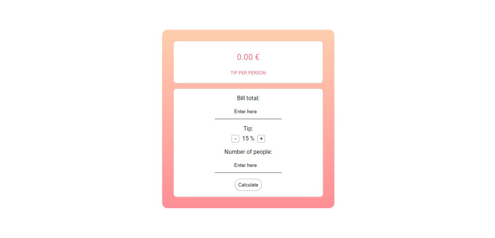
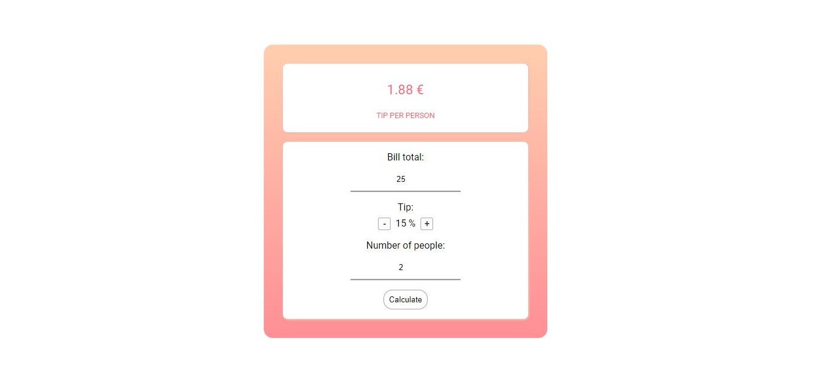

# Tip calculator
You can visit the application [here](https://jennilehtonen.github.io/Tip-calculator/).
Used technologies: **HTML, CSS and JavaScript.**

I wanted to create some simple program that calculates something so I ended up developing a tip calculator.

Here you can see the tip calculator when the user has not given any numbers yet.

Here you can see tip calculator when the user has given numbers to it.

